# AI Research Agent

From a complex research question to a sourced, citation-checked report.

Control flow lives in code, judgement lives in the model. The agent plans sub-questions, searches
in parallel, scores sources, extracts **claims with verbatim quotes**, clusters them into findings,
detects duplicates and contradictions, decides by rule whether it knows enough - and passes the
report through a **deterministic output gate** before anyone sees it.

Everything runs locally with Docker: a Python API and agent, a Go dispatcher, PostgreSQL,
Microsoft Presidio and self-hosted Langfuse. The only thing you bring is API keys.

> Design rationale: [`docs/design/architecture_v0.6.md`](docs/design/architecture_v0.6.md) (Turkish) ·
> decision log: [`TODO.md`](TODO.md) · audit: [`docs/design/analysis_v1.md`](docs/design/analysis_v1.md) ·
> evaluation and measured limits: [`docs/review/evaluation_v3.md`](docs/review/evaluation_v3.md) ·
> example runs: [`examples/`](examples/README.md) · answers to the case's design questions: [§16](#16-design-questions)
> · [submission checklist and verification](docs/review/submission_checklist.md)

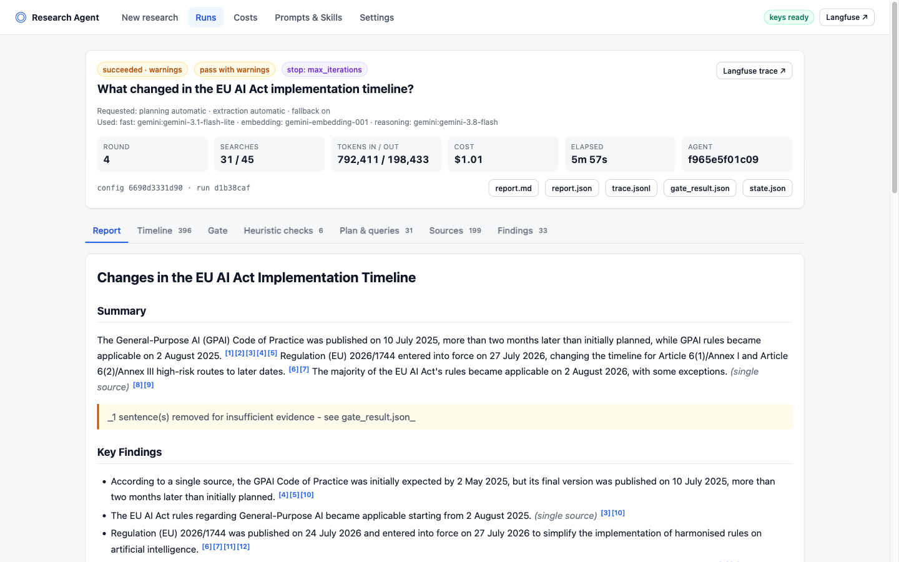

<details>
<summary>More screenshots of the running system</summary>

|                                                                                                                                |                                                                                                                   |
| ------------------------------------------------------------------------------------------------------------------------------ | ----------------------------------------------------------------------------------------------------------------- |
| **New research** - question, model choice per stage, advanced limits<br>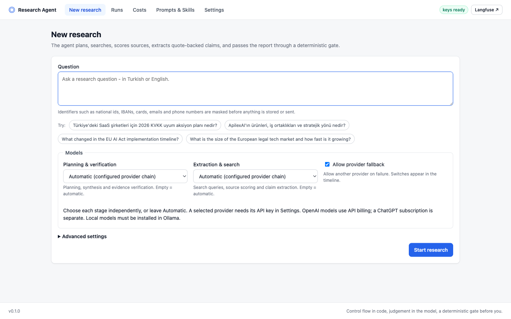  | **Runs** - status, stop reason, gate verdict, cost and duration<br>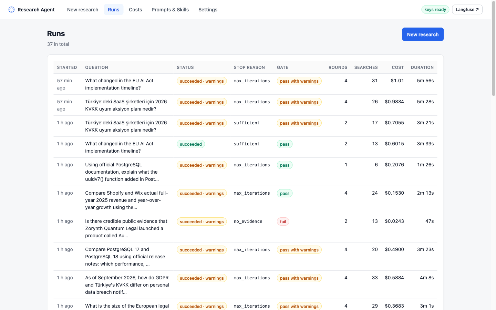          |
| **Timeline** - every dispatcher and agent step, live over SSE<br>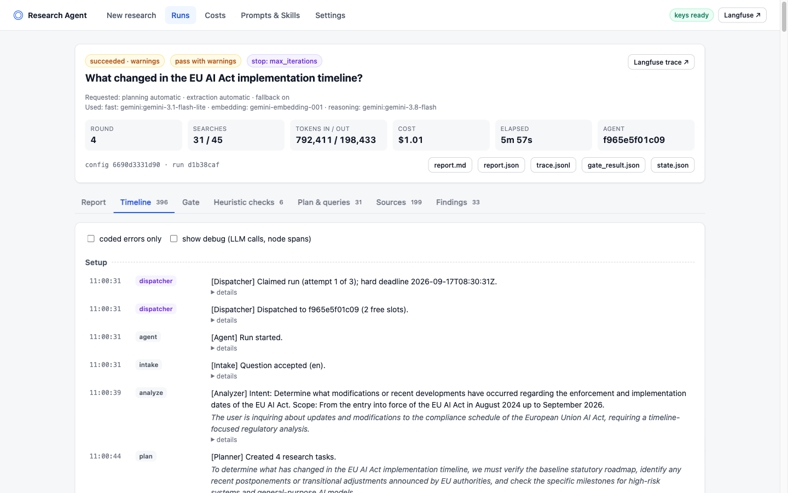             | **Output gate** - deterministic G1-G12 checks with removed sentences<br>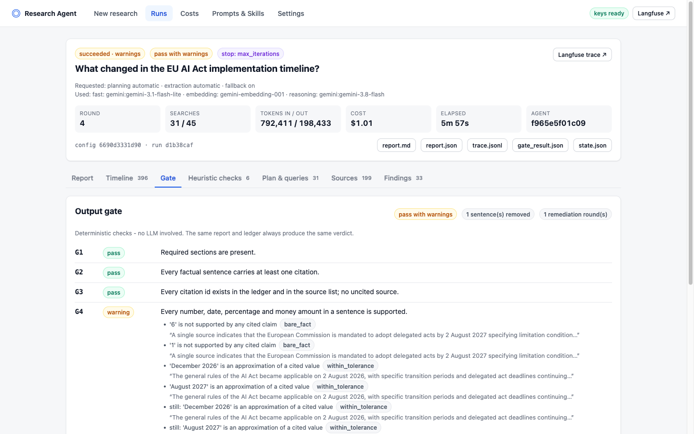 |
| **Findings** - contradictions and the claim ledger<br>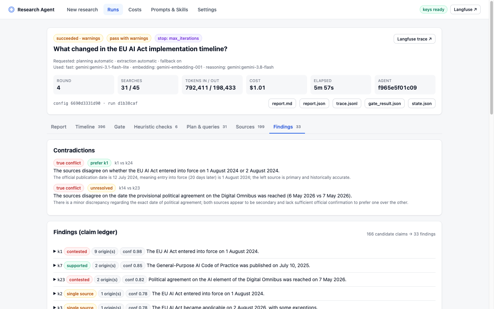                        | **Costs** - per model, node and search provider<br>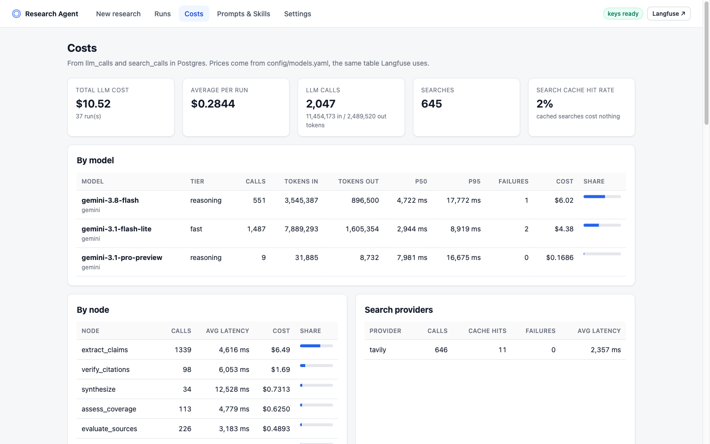                        |
| **Prompts & Skills** - signatures, active prompt versions, schema hashes<br>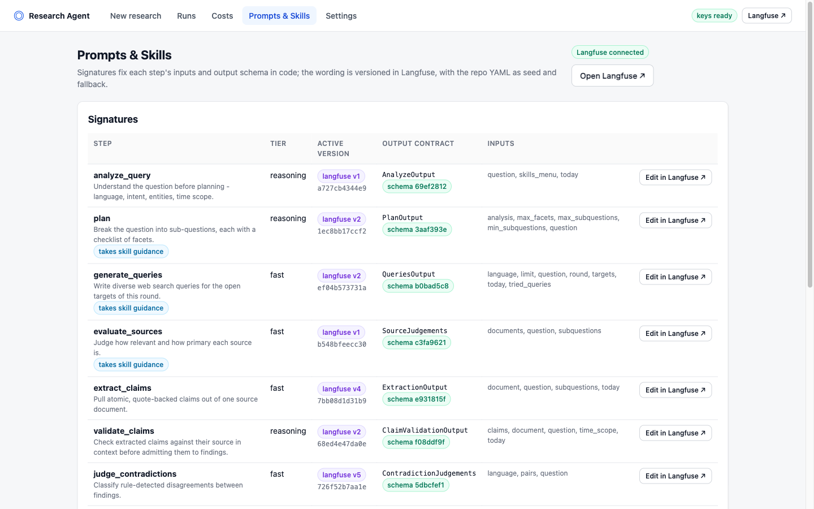 | **Settings** - provider keys, kept in the browser tab<br>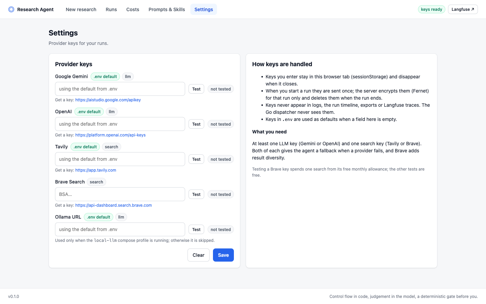            |

</details>

---

## 1. Quickstart

Requirements: Docker with Compose v2. The full stack uses about 4 GB of memory once running
(Langfuse, ClickHouse and Presidio are the heavy parts); lightweight mode about 1.5 GB.

```bash
cp .env.example .env         # required for the documented observability profile; keys can use the UI
docker compose up -d --build # first start pulls images and builds (a few minutes)
open http://localhost:8000   # the app
```

**The one manual step: API keys.** You need one LLM key and one search key:

| Kind   | Providers (either works; both give the agent a fallback)                                             |
| ------ | ---------------------------------------------------------------------------------------------------- |
| LLM    | [Google Gemini](https://aistudio.google.com/apikey) · [OpenAI](https://platform.openai.com/api-keys) |
| Search | [Tavily](https://app.tavily.com) · [Brave Search](https://api-dashboard.search.brave.com)            |

Either paste them into **Settings** in the app (kept in the browser tab, encrypted per run on the
server, deleted when the run ends) or put them in `.env` as `GEMINI_API_KEY`, `OPENAI_API_KEY`,
`TAVILY_API_KEY`, `BRAVE_API_KEY` and run `docker compose up -d` again. Every other value has a
working local default - the database password, the encryption key (generated on first start),
and Langfuse's admin user and API keys (created headlessly).

| URL                          | What                                                                |
| ---------------------------- | ------------------------------------------------------------------- |
| http://localhost:8000        | The app: new research, live runs, reports, costs, prompts, settings |
| http://localhost:3000        | Langfuse - log in with `admin@research.local` / `research-admin`    |
| http://localhost:8000/docs   | OpenAPI docs of the REST API                                        |
| http://localhost:8000/readyz | Which dependencies answer                                           |

**Lightweight mode** - no Langfuse, ClickHouse, Redis or MinIO. The system stays fully functional:
traces come from Postgres, prompts from the repo YAML seeds.

```bash
COMPOSE_PROFILES= docker compose up -d      # or set COMPOSE_PROFILES= in .env
```

**Port already taken?** `API_HOST_PORT=8010 docker compose up -d` (likewise `LANGFUSE_HOST_PORT`,
`LANGFUSE_MINIO_HOST_PORT`, `POSTGRES_HOST_PORT`).

**No keys yet?** `make demo` records an offline run (a rule-based stand-in model over a three-page
built-in corpus) so every screen can be explored. It is marked "offline demo" in the UI and costs nothing.

<details>
<summary>More commands</summary>

```bash
docker compose up -d --scale agent=3             # more agent replicas; the dispatcher finds them by DNS
docker compose logs -f api agent dispatcher      # structured JSON logs, same field names in Python and Go
docker compose --profile local-llm up -d         # add Ollama as the last link of the LLM chain
make examples                                    # the four case examples, with your keys
make reset                                       # stop everything and delete all data

# The research CLI - same agent, no service layer; persist exports on the host.
mkdir -p examples
docker compose run --rm --no-deps --user "$(id -u):$(id -g)" \
  -v "$PWD/examples:/app/examples" agent run "Your question" --out examples/my-run
# Add --simulate to that command for an offline run with no keys.
docker compose run --rm agent config --override budget.max_searches=20
```

</details>

### Choose models and review the checks

In **New research → Models**, choose **Planning & verification** and **Extraction & search** independently. Options include Gemini 3.1 Pro (preview), Gemini 2.5 Pro,
Gemini Flash, OpenAI GPT-6 Astra / GPT-5.6 Sol, Terra and Luna, and local Ollama Qwen3 models.
The dropdowns come from [`config/models.yaml`](config/models.yaml); account access and quotas
still apply. OpenAI models use an OpenAI API key and API billing.

**Automatic** uses the configured Gemini → OpenAI → Ollama chain. An explicit choice tries that
model first. **Allow provider fallback** controls whether another provider may take over;
disable it for strict model comparisons. Missing credentials for an explicitly selected model
are rejected before queuing. The run header and exports show requested and actually used models;
presets preserve both selections and the fallback setting. Embeddings retain their separate chain.

The same controls work through the API's `overrides` object or the CLI:

```bash
docker compose run --rm --no-deps --user "$(id -u):$(id -g)" \
  -v "$PWD/examples:/app/examples" agent run "Your question" \
  --override llm.reasoning_model=gemini-3.1-pro-preview \
  --override llm.fast_model=gemini-3.1-flash-lite \
  --override llm.allow_fallback=false --out examples/pro-run
```

Every new run has a **Heuristic checks** tab and corresponding timeline steps:

| Step | Check                                                                   |
| ---- | ----------------------------------------------------------------------- |
| H1   | Comparison entities remain represented in the plan                      |
| H2   | Old or undated mutable claims are withheld pending current confirmation |
| H3   | Candidates without affirmative source support are withheld              |
| H4   | Detected applicability restrictions are represented in the claim        |
| H5   | Findings relying on a single independent origin are visible             |
| H6   | Citation and numeric integrity before gate remediation                  |

A pass means that particular heuristic found no issue; it is not a factual-accuracy certificate.
The gate records final structural checks after remediation. For developer acceptance, run
`make verify` and follow the [manual review steps](evals/README.md#manual-heuristic-review).

## 2. Technologies

| Layer         | Choice                                                                                                                                                            |
| ------------- | ----------------------------------------------------------------------------------------------------------------------------------------------------------------- |
| Orchestration | LangGraph `StateGraph` - nodes are plain async functions, routing and termination are plain Python; Postgres checkpointer                                         |
| LLM           | Gemini → OpenAI → Ollama fallback chain over REST (no vendor SDKs); `reasoning` and `fast` tiers; strict JSON-schema structured output                            |
| Search        | Tavily (primary, returns page text) + Brave (fallback and diversity); `trafilatura` for pages that need fetching                                                  |
| Runtime       | Python 3.13, uv, FastAPI, Pydantic v2, SQLAlchemy 2 + Alembic, psycopg 3, httpx, structlog, datasketch                                                            |
| Control plane | Go 1.27 dispatcher - queue claim, capacity, heartbeat watchdog, hard deadline, cancel, retry; distroless image                                                    |
| Storage       | PostgreSQL 16 - run queue (`FOR UPDATE SKIP LOCKED` + `LISTEN/NOTIFY`), event store, checkpoints, caches, presets                                                 |
| PII           | Microsoft Presidio analyzer with Turkish ad-hoc recognisers, always unioned with regex rules; stable placeholders assigned in code                                |
| Observability | Postgres `run_events` (primary) + self-hosted Langfuse v4 over OTLP (traces, prompt versions, cost)                                                               |
| Frontend      | Static HTML + ES modules + Server-Sent Events, no build step                                                                                                      |
| Quality       | pytest (548 tests incl. Postgres integration and offline end-to-end graph runs), Go tests with the race detector, ruff, mypy `--strict`, pre-commit with gitleaks |

## 3. Architecture

### 3.1 Services

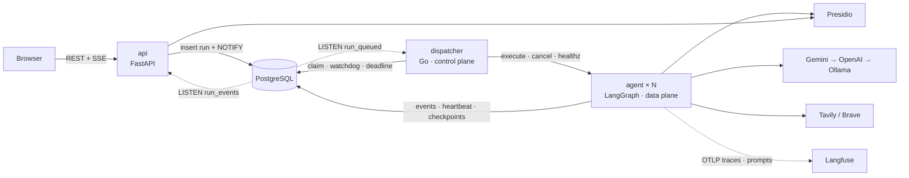

The **dispatcher** only schedules: it claims queued runs with `SKIP LOCKED`, hands them to the
agent replica with the most free slots (`202 Accepted`, not a long request), requeues runs whose
heartbeat stops, and enforces a database deadline whose terminal write ignores intervening heartbeats. It holds no run state and
refuses to start if given a provider key. The **agent** runs the graph, heartbeats every 10 s,
checkpoints every node, and writes the terminal status itself. Every dispatch receives a unique lease. Worker progress, events, checkpoints and completion
are fenced by that lease; terminal status, counters, artifacts and final events commit together.
Every status write on either side is a compare-and-set checked against the shared state machine in [`contracts/`](contracts/).

A killed agent is recovered like this (verified): heartbeat stale after 30 s →
`AGENT_HEARTBEAT_LOST` → requeued with backoff → another replica resumes from the LangGraph
checkpoint, without re-running finished nodes, under the original deadline.

### 3.2 Agent workflow

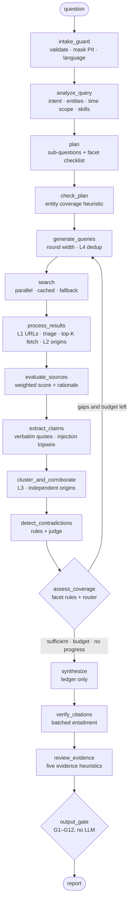

Every LLM step returns a Pydantic object with a short `rationale`, which the run timeline shows -
the auditable reason for a decision, not hidden chain of thought. Planning and synthesis have deterministic fallbacks (heuristic analysis, a single-question plan,
template queries, rule-based scores, a ledger report). Claim and citation verification fail closed:
missing verdicts withhold evidence. If every provider is unavailable, a run can fail explicitly.

### 3.3 The central abstraction: the claim ledger

```
SearchHit → Document (score, origin) → Claim (+ verbatim quote) → ClaimCluster (finding) → sentence in the report
```

The system reasons about **claims**, not documents. One data model answers four requirements:

| Requirement    | In the ledger                                                                                   |
| -------------- | ----------------------------------------------------------------------------------------------- |
| Duplicates     | Near-identical pages share one `origin`; the same fact in different words is one cluster        |
| Corroboration  | A cluster's support is its number of **independent origins** - never its URL count              |
| Contradictions | Two clusters with the same entity and attribute but different values                            |
| Citations      | The synthesiser may only cite cluster ids; each id already knows its claims, quotes and sources |

## 4. Search strategy

- **Decomposition.** The planner writes 3-6 self-contained sub-questions, each with 1-5 checkable
  _facets_ ("effective date", "penalty amount"). A sub-question is answered when all its facets are.
- **Round width is the budget control.** Round 1: up to 3 queries per open sub-question. Later
  rounds: one query per missing facet or unresolved contradiction, at most 8 per round. Four
  rounds therefore fit the 45-search budget.
- **Diversity.** Queries for the same target vary the angle (official vs. news), specificity and
  language (Turkish and English when both have sources). With both keys, every third query goes to
  Brave first. Skills add domain-specific query patterns (e.g. law numbers, `site:kvkk.gov.tr`).
- **No repeats.** Queries are deduplicated against everything already tried (L4). A follow-up round
  that can only produce repeats marks the sub-question exhausted.
- **Parallel, cached, bounded.** Searches run concurrently under a semaphore, retry with backoff,
  fall back to the other provider, and are cached in Postgres. An empty result gets one broadened
  retry. Cache hits still count against the budget so a cached re-run decides identically.
- **Snippet-first triage.** Only the top 5 documents per sub-question (3 in later rounds) are read in
  full; Tavily usually returns the page text with the result, otherwise the page is fetched with a
  byte cap and extracted with trafilatura.

## 5. Source evaluation

```
score = 0.35·authority + 0.25·primary + 0.15·recency + 0.25·relevance
```

- **Authority** comes from [`config/domain_tiers.yaml`](config/domain_tiers.yaml): T1 regulators and
  official sources, T2 established news and research firms, T3 everything else. Skills may add T1/T2
  domains for a run. The model may nudge authority by ±0.1 but can never move a domain across a
  tier - a page cannot talk its way into being a regulator.
- **Primary** if the publisher is the origin of the information: tier-1 sources, or the company's own
  domain for claims about itself; the model can recognise other primary sources outside tier 3.
- **Recency** relative to the question's time scope: in-scope and fresh scores high, older than the
  scope is penalised, undated is slightly below neutral.
- **Relevance** is judged by the model (with a token-overlap fallback).

Claim admission is a separate check: source entailment, conditions, effective dates and the
question’s time scope are retained in the ledger. Mutable old/undated values cannot close a
current facet. Regulatory rule claims additionally need a primary rule or detailed guidance;
commentary and identified official overview/press pages trigger a targeted follow-up.

Every score is written to the timeline with its components:
`[Evaluator] kvkk.gov.tr → 0.91 (T1, primary, 2026-03, relevance 0.85)`.

## 6. Duplicate detection

| Layer       | Method                                                                                                      | Catches                                                                                                              |
| ----------- | ----------------------------------------------------------------------------------------------------------- | -------------------------------------------------------------------------------------------------------------------- |
| L1 URL      | Canonicalisation: scheme, `www`/`m`/`amp` hosts, AMP suffixes, tracking parameters, sorted query, fragments | The same page twice                                                                                                  |
| L2 Document | Normalised-text hash, then MinHash LSH (word 5-grams, Jaccard ≥ 0.8) → shared `origin_id`                   | Syndicated press releases, republished articles                                                                      |
| L2b Quotes  | Pages sharing ≥ 2 verbatim quotes of ≥ 12 words merge their origins                                         | The same press release inside different page chrome (menus, related articles) that keeps MinHash below the threshold |
| Publisher   | Origins on the same site (`tr.linkedin.com` = `linkedin.com`) count once                                    | Four pages of the company's own website presented as four confirmations                                              |
| L3 Claim    | Embedding cosine (one embedding model per run, cached) **and** the same normalised entity; lexical fallback | One fact phrased differently                                                                                         |
| L4 Query    | Normalised token Jaccard ≥ 0.9                                                                              | The same query generated again                                                                                       |

Two rules make the layers matter: **corroboration counts origins** (five sites carrying one press
release are one confirmation; a claim attributed to someone - "according to the ministry" - takes
that speaker as its origin), and **claims with different values are never merged**, however
similar the wording, because merging them would hide a contradiction.

## 7. Follow-up search and termination

After each round the code - not the model - updates every facet:

> a facet is **sufficient** if a primary source scoring ≥ 0.7 supports it, or ≥ 2 independent
> origins do - and no contradiction still awaiting its targeted follow-up blocks it.

An unresolved contradiction blocks coverage until its one targeted follow-up is attempted.
After that it remains contested and must be reported with uncertainty labels, but stops forcing
more searches. Thus `sufficient` means the coverage policy is satisfied; it does not mean every
conflict was resolved. Claims must also pass support, freshness and legal-authority checks (§5).

The model's coverage review may add a missing facet and writes the gap note
(`[Research State] Missing information: partnerships.`), but it does not decide. Then the router
checks, in order:

1. **Success** - every `must` sub-question is sufficient → `sufficient`
2. **Hard limits** - `max_iterations` (4) or `max_searches` (45); optional wall-clock and cost
   budgets (off by default, enabled per run) → `budget` / `max_iterations`
3. **No progress** - a sub-question with no new finding or origin for 2 rounds is exhausted; when
   nothing is open → `no_progress`
4. Otherwise the next round searches **only the gaps**.

Whatever the reason, the report is written; exhausted and unanswered sub-questions are listed under
**Known Gaps**, and the stop reason appears in the report metadata and the UI. No evidence at all
gives a report that says so (`no_evidence`), never an invented answer.

## 8. Contradiction handling

1. **Candidates by rule:** the same entity (spelling variants such as "Europe legal tech" /
   "European legal technology" match), the same attribute (qualifiers like "projected" and
   synonyms like "valuation"/"size" are ignored), the same period when both state one, and values
   that do not match within tolerance - compared with their units and scales (numbers, money,
   percentages and dates are normalised - see §9). A 2025 figure next to a 2030 forecast never
   reaches the judge.
2. **Classification by a judge:** true conflict, different point in time, different scope,
   rounding, or consistent (the same statement in other words). Only true conflicts mark findings
   as contested.
3. **Resolution:** the judge may prefer one side, but the preference only counts if the ledger backs
   it - a primary source that outranks the other side. The conflict is **still reported**.
   Unresolved conflicts get one targeted follow-up query looking for the primary source.
4. If it stays unresolved, the report's **Conflicting / Uncertain** section presents both values with
   their sources, and any sentence elsewhere that cites a contested finding is labelled uncertain.

## 9. The output gate

Every report is evaluated against twelve deterministic rules ([`config/gate.yaml`](config/gate.yaml)).
No LLM call: the same report and ledger always give the same verdict - which also means a prompt
injection or a hallucinating model cannot argue with it.

| Rule | Checks                                                                     | If violated                                                          |
| ---- | -------------------------------------------------------------------------- | -------------------------------------------------------------------- |
| G1   | Required sections present; at least one supported finding                  | Section added / **fail**                                             |
| G2   | Every factual sentence cites a finding                                     | Sentence removed                                                     |
| G3   | Citations exist in the ledger; source list matches citations               | Citation dropped, list rebuilt                                       |
| G4   | Every number, date, percentage and amount is supported                     | By bucket, below                                                     |
| G5   | Contested findings are hedged                                              | Labelled uncertain                                                   |
| G6   | Single-source findings are labelled                                        | Labelled                                                             |
| G7   | Exhausted sub-questions are in Known Gaps                                  | Added                                                                |
| G8   | Source URLs valid, canonical, unique                                       | Fixed or dropped                                                     |
| G9   | No sensitive identifier or secret in the output                            | Masked                                                               |
| G10  | Report language = question language; a Turkish report uses Turkish letters | Flagged (synthesis already rewrote an ASCII-only Turkish draft once) |
| G11  | Every recommendation rests on a finding                                    | Removed                                                              |
| G12  | Cited claims remain eligible after support and freshness checks            | Removed                                                              |

**G4 sorts every quantity into a bucket** before judging it, because "the number must appear in a
cited claim" alone would delete correct sentences:

- **context** - it appears in the question ("2026") → allowed;
- **ledger-derived** - a count of sources, findings or sub-questions → recomputed from the ledger;
- **bare fact** - must match a cited claim exactly (`1.2M` = `1,2 milyon`, `%15` = `15%`,
  currencies must agree) → otherwise the sentence is removed;
- **within tolerance** - rounding to the precision written (`$1.23 billion` as `$1.2 billion`),
  or a coarser date (`March 2026` for `2026-03-12`) → kept with an "approximate" label.

The gate evaluates, remediates deterministically, and evaluates again. If an error survives, the
report is still delivered - with a red "insufficient evidence" banner and the list of problems.
Whenever a sentence was removed, the report says how many. The full result is in
`gate_result.json` and in the run's **Gate** tab. `max_remediation_rounds=0` evaluates without
changing the report; positive limits run at most that many remediation rounds.

## 10. PII handling

Three boundaries (v0.6 §12):

- **Intake** - before the question is stored or sent anywhere, national ids (TCKN, checksum
  validated), IBANs, cards (Luhn), emails, phone numbers and IPs are replaced with stable
  placeholders (`<TCKN_1>` twice means one person). Presidio does the detection with Turkish ad-hoc
  recognisers; its findings are always unioned with regex rules, and if Presidio is down the regex
  rules run alone (`PII_ENGINE_DEGRADED`). Person and company names are **not** masked - they are
  what the research is about (configurable).
- **Telemetry** - every log line, run event, stored LLM/search payload and Langfuse span passes
  through redaction (provider keys, bearer tokens, connection strings and the identifiers above).
  Tests assert that keys never appear in responses, events or Langfuse payloads.
- **Output** - gate rule G9.

Provider keys follow their own path: browser tab → encrypted per run (Fernet) in `run_secrets` →
read by the agent → deleted with the run's terminal status. The dispatcher never sees them.

## 11. Observability

- **`run_events`** in Postgres is the primary trace, written by the agent and the dispatcher onto
  one gap-free timeline and streamed to the UI over SSE (resumable with `Last-Event-ID`). The
  console and UI keep the case's format: `[Planner] Created 4 research tasks.`,
  `[Search] Received 8 results.`, `[Research State] Missing information: partnerships.`
- **`llm_calls` / `search_calls`** record every attempt with tokens, cost, latency, prompt version
  and fallback source; they feed the **Costs** screen.
- **Langfuse** (self-hosted, headless init) receives each run as an OTLP trace with a generation per
  LLM call - usage, cost and the prompt name and version - and hosts prompt management. Prices live
  in [`config/models.yaml`](config/models.yaml), so both dashboards show the same numbers.
- **Logs** are JSON from both languages with shared fields (`service`, `run_id`, `span_id`, `node`,
  `event`, `error_code`).
- **Reproducibility** - each run stores its effective configuration and hash, the prompt versions
  and content hashes, the models used and the skills chosen.

## 12. Error handling

Every failure has a code from [`contracts/error_codes.yaml`](contracts/error_codes.yaml), shared by
Python and Go. Expected failures are handled, logged at warning level as
**error → decision → outcome**, and the run continues:

```
SEARCH_TIMEOUT (tavily, 2/3) → retry in 2s → fallback->brave → Received 7 results
```

Unexpected ones (`UNEXPECTED_EXCEPTION`) fail the run with a redacted stack trace and an event id.

| Situation                           | Code                                                             | Behaviour                                                                  |
| ----------------------------------- | ---------------------------------------------------------------- | -------------------------------------------------------------------------- |
| Search timeout / 5xx / 429          | `SEARCH_TIMEOUT` · `SEARCH_PROVIDER_ERROR` · `SEARCH_RATE_LIMIT` | Retry with backoff → other provider → query marked failed, run continues   |
| Rejected search key                 | `SEARCH_AUTH`                                                    | No retry → other provider                                                  |
| Empty result                        | `SEARCH_EMPTY`                                                   | Other provider; one broadened query                                        |
| LLM timeout / 5xx / 429             | `LLM_TIMEOUT` · `LLM_PROVIDER_ERROR` · `LLM_RATE_LIMIT`          | Retry → next provider (`LLM_FALLBACK_USED`) → node fallback                |
| Rejected LLM key                    | `LLM_AUTH`                                                       | Next provider; none left → run fails with a message naming the missing key |
| Invalid structured output           | `LLM_INVALID_OUTPUT` → `LLM_REPAIR_FAILED`                       | One repair turn with the validation error → node fallback                  |
| Quote not in the page               | `EXTRACT_QUOTE_NOT_FOUND`                                        | Claim discarded                                                            |
| Page fetch fails                    | `FETCH_FAILED`                                                   | Continue with the snippet                                                  |
| Embeddings unavailable              | `EMBEDDING_UNAVAILABLE`                                          | Lexical similarity for the rest of the run                                 |
| Repeated queries                    | `DUPLICATE_QUERY`                                                | Sub-question exhausted                                                     |
| Budget / rounds used                | `BUDGET_EXCEEDED` · `MAX_ITERATIONS`                             | Controlled stop, Known Gaps                                                |
| No evidence                         | `NO_EVIDENCE`                                                    | "No sufficient evidence" report                                            |
| Presidio down                       | `PII_ENGINE_DEGRADED`                                            | Regex masking only                                                         |
| Langfuse down / prompt incompatible | `PROMPT_REGISTRY_DEGRADED` · `PROMPT_SCHEMA_MISMATCH`            | Repo YAML prompt                                                           |
| Gate                                | `GATE_REMEDIATED` · `GATE_FAILED`                                | Fixes / report with banner                                                 |
| Agent unreachable / crashed         | `AGENT_UNREACHABLE` · `AGENT_HEARTBEAT_LOST`                     | Other replica / requeue and resume (≤ 3 attempts)                          |
| Hard deadline                       | `DEADLINE_EXCEEDED`                                              | Agent asked to stop, then failed after a grace period                      |
| Invalid settings                    | `CONFIG_INVALID`                                                 | Rejected before the run exists                                             |

## 13. Examples

See [`examples/README.md`](examples/README.md). **Start with
[`examples/2026-09-17-final/`](examples/2026-09-17-final/)**: eight distinct questions run with real
keys through the API, each with `input.md`, `trace.jsonl`, `report.md`, `report.json`,
`gate_result.json` and `state.json.gz` (the full ledger, gzip-compressed). The
[results index](examples/2026-09-17-RESULTS.md) lists every batch with duration, cost, searches,
gate verdict, stop reason and what was still wrong; nothing was rewritten after the fact.

| #   | Question                                                                       | Why this one                                            |
| --- | ------------------------------------------------------------------------------ | ------------------------------------------------------- |
| 1   | Türkiye'deki SaaS şirketleri için 2026 KVKK uyum aksiyon planı nedir?          | Turkish regulation, action plan tied to findings        |
| 2   | ApilexAI'ın ürünleri, iş ortaklıkları ve stratejik yönü nedir?                 | Thin coverage → Known Gaps                              |
| 3   | What changed in the EU AI Act implementation timeline?                         | Conflicting dates → contradiction handling              |
| 4   | What is the size of the European legal tech market and how fast is it growing? | Numeric disagreement → G4, conflicting section          |
| 5   | GDPR vs. KVKK breach notification (asked in English about Türkiye)             | Report language follows the question, not the topic     |
| 6   | PostgreSQL 17 vs. 18 from official release notes                               | A technical domain, primary sources                     |
| 7   | Shopify vs. Wix full-year 2025 revenue                                         | Both comparison entities must stay in the plan (H1)     |
| 8   | A made-up company and product                                                  | Honest abstention: `no_evidence`, gate `fail` by design |

`make examples` regenerates the four case questions with your keys; a run started in the UI can be
exported in the same format. The four top-level folders are the first live runs (2026-09-16);
[`examples/ANALYSIS.md`](examples/ANALYSIS.md) lists the eight defects they exposed and the fixes.
`examples/offline-demo-eu-ai-act/` shows the file format from a keyless offline run.

Across the eight questions a run took **50–306 seconds** and **$0.02–0.70** in recorded LLM cost;
the legal reruns after the primary-source rule cost about $1 each. These are measurements from this
machine, not guarantees; costs use token counts and exclude search credits and infrastructure.
The Gemini 3.1 Pro browser run took **94 seconds / $0.21**.

## 14. Tests

Local development commands require **uv**, **Python 3.13** (uv can install it), **Go 1.27**
and **make**. Docker is also required for the disposable integration database. From the repository
root, install the locked Python dependencies first:

```bash
uv sync --locked
```

```bash
make verify             # lint, full suite, Go race tests, offline evidence fixtures
make test               # unit + contract tests, Python and Go, no database
make test-integration   # adds Postgres integration tests (starts a throwaway container)
make test-docker        # the Python suite inside the compose network
make lint               # ruff, mypy --strict, gofmt, go vet
```

| Layer       | Covers                                                                                                                                                                                                                                                                                                                                                                                                                                     |
| ----------- | ------------------------------------------------------------------------------------------------------------------------------------------------------------------------------------------------------------------------------------------------------------------------------------------------------------------------------------------------------------------------------------------------------------------------------------------ |
| Unit        | Contracts, config bounds and locked settings, redaction, masking (+Presidio), key handling, URL canonicalisation, MinHash, query dedup, scoring, quote verification, injection tripwire, clustering, contradiction candidates, facet sufficiency, router, number/date normalisation, every gate rule, providers (request shapes, error mapping, retry, fallback, repair), schemas on the wire, prompt registry and skills, Langfuse export |
| Scenario    | The whole graph offline: success in one round, stagnation, max rounds, search budget, wall-clock and cost budgets switched on, search and LLM provider fallback, repair failure, no evidence, prompt injection, PII never reaching a provider, cancellation, **crash and resume from checkpoint**, Turkish reports, the CLI                                                                                                                |
| API         | Run creation with masking, encryption and override validation, SSE backfill / resume / live, cancel, export, costs, prompts, no key in any response                                                                                                                                                                                                                                                                                        |
| Integration | Migrations match the models; events are gap-free under concurrency; concurrent claims never double-claim; compare-and-set races; requeue budget; secrets deleted on finish; agent server behaviour against real Postgres                                                                                                                                                                                                                   |
| Go          | Watchdog decision table, dispatch and fallback, capacity ranking and DNS discovery, agent client ↔ OpenAPI contract, state machine ↔ contract, store against Postgres (concurrent claims, CAS races, deadlines, backoff), NOTIFY listener                                                                                                                                                                                                  |

Direct entry points for the case's requested critical components:

| Component           | Tests                                                                                                                                                    |
| ------------------- | -------------------------------------------------------------------------------------------------------------------------------------------------------- |
| Duplicate detection | [URL, document and query dedup](agent/tests/unit/agent/test_dedup.py), [syndication](agent/tests/unit/agent/test_syndication.py)                         |
| Query generation    | [Quota enforcement, duplicates, fallback, gap-only follow-up and exhaustion](agent/tests/unit/agent/test_query_generation.py)                            |
| Source scoring      | [Weights, primary sources, recency and authority bounds](agent/tests/unit/agent/test_scoring_and_quotes.py)                                              |
| State transitions   | [Shared state contract](agent/tests/unit/test_contracts.py), [lease and stale-worker integration](agent/tests/integration/test_leases.py)                |
| Termination logic   | [Coverage, stagnation and stop rules](agent/tests/unit/agent/test_ledger_logic.py), [whole-graph scenarios](agent/tests/scenario/test_research_graph.py) |

## 15. Design decisions

- **Control flow in code, judgement in the model.** Loops, budgets, stop rules, dedup and scoring
  are deterministic and unit-tested; the model is asked narrow questions with typed answers.
  A free-form tool-calling agent gives weaker termination guarantees and is harder to test.
- **The claim ledger** as the unit of reasoning - one model for duplicates, corroboration,
  contradictions and citations.
- **A deterministic gate** as the last word, with remediation and a visible banner instead of silent
  failure.
- **Control plane / data plane split.** A small Go dispatcher owns scheduling, deadlines and
  recovery; agents can crash without losing runs, and a buggy agent cannot run forever. The price -
  a second language and an HTTP contract - is paid down with shared contract files and contract
  tests on both sides.
- **Prompts as versioned artefacts.** Signatures (typed I/O) in code, wording in Langfuse with repo
  YAML seeds, accepted only if the output-schema hash and template variables match the code.
- **One LLM access layer over REST** - fallback, retries, repair, redaction, cost and tracing are
  written once; no second LLM stack in the runtime.
- **Skills as data** (Agent Skills format): domain guidance and trusted domains, no scripts, no
  control over budgets or the gate.

The full log with alternatives considered is in [`TODO.md`](TODO.md).

### Known limitations

- Turkish person-name detection in Presidio is weak (English NER model); names are not masked by
  default for this reason and because they are the subject of research.
- Market-size and similar questions depend heavily on what search providers return; paywalled
  research is only visible through its public summaries.
- Model validation and deterministic checks reduce errors; they do not establish factual truth.
  Source errors, omitted exceptions and missing retrieval remain possible. The legal policy
  withholds rule-bearing claims from commentary and identified overview pages; its domain, URL
  and wording heuristics can miss cases or reject useful evidence. Read [evaluation v3](docs/review/evaluation_v3.md).
- Independence is judged by text and publisher: verbatim copies (MinHash, shared quotes) and
  pages of one site count once. A press release that several outlets **rewrote in their own
  words** can still count separately if the common attribution was not extracted.
- Contradiction candidates need the extractor to name entity, attribute and period consistently;
  different wordings are normalised, but a conflict between differently framed facts ("most
  rules apply from 2026" vs. "high-risk rules were postponed") is left to the synthesiser.
- Runs are not deterministic: the same question can stop after one round or four, depending on
  what search returns and what the models extract (see [`examples/ANALYSIS.md`](examples/ANALYSIS.md)).
- Stricter evidence rules trade cost and coverage for fewer wrong statements: most repeat runs
  used all four rounds, and the legal reruns cost about $1 each and reported more Known Gaps
  (see §16, question 7).
- The Turkish-letter check (G10) catches a report written in ASCII, not individual spelling
  mistakes.
- The offline prompt optimisation job (DSPy/GEPA) from the design document was not implemented;
  prompts are versioned and hand-tuned from live runs.
- No authentication - this is a local, single-user deployment.

---

## 16. Design Questions

### 1. Agent araştırmayı ne zaman sonlandırıyor?

Durma kararını LLM değil kod veriyor.

Her alt sorunun, cevaplanmış sayılması için gereken kontrol edilebilir maddeleri (facet) var.
Her turdan sonra bu maddeler kuralla güncellenir. Bir madde şu durumda **yeterli** sayılır:

- skoru ≥ 0.7 olan birincil bir kaynak onu destekliyor, **ya da** en az iki bağımsız kaynak destekliyor;
- ona dokunan, hedefli takip araması henüz denenmemiş bir çelişki yok;
- destekleyen iddia doğrulanmış ve güncel. Eski ya da tarihsiz, değişebilir bir değer (ör. bir
  eşik tutarı) maddeyi tek başına kapatamaz. Hukuki yükümlülüklerde birincil bir mevzuat metni ya
  da ayrıntılı resmî rehber aranır.

Çelişki için bir takip araması denendikten sonra çelişki çözülemese de kapsam kararını
engellemeyi bırakır; bulgu tartışmalı kalır ve raporda iki taraf belirsizlik etiketiyle verilir.
Bu yüzden `sufficient`, tüm çelişkilerin çözüldüğü değil, kapsam politikasının karşılandığı anlamına gelir.

Router her turdan sonra şu sırayla karar verir:

1. Zorunlu (`must`) alt soruların hepsi yeterliyse → `sufficient` (başarı).
2. Bütçe bittiyse → `max_iterations` ya da `budget`. Bütçe: 4 tur ve 45 arama; süre ve maliyet
   limitleri isteğe bağlı olarak run başına açılabilir.
3. Açık alt soru kalmadıysa (kalanların hepsi tükendiyse) → `no_progress`.
4. Bunların hiçbiri değilse yeni bir tura geçilir. Yeni tur yalnızca eksik maddeleri ve çözülmemiş
   çelişkileri arar.

Hangi nedenle durursa dursun rapor yazılır:

- Cevaplanamayan alt sorular "Bilinen Eksikler" bölümünde nedenleriyle listelenir.
- Durma nedeni raporda ve arayüzde görünür.
- Hiç kanıt bulunamadıysa sonuç `no_evidence` olur. Bu durumda uydurma bir cevap değil, "yeterli
  kanıt bulunamadı" diyen bir rapor döner. Örnek: `examples/2026-09-17-final/fictional-company-evidence-limit`.
- Kullanıcı run'ı iptal ederse neden `cancelled` olur.

### 2. Sistemin sonsuz search loop'una girmesini nasıl engelliyorsunuz?

Birbirinden bağımsız katmanlarla. Biri çalışmasa bile diğeri durdurur.

1. **Sabit limitler.** En fazla 4 tur ve 45 arama. Önbellekten dönen aramalar da bütçeden düşer.
   Tur genişliği de sınırlı:
   - ilk turda alt soru başına en fazla 3 sorgu;
   - sonraki turlarda eksik madde başına 1 sorgu, turda toplam en fazla 8.
2. **Durgunluk.** İki tur boyunca yeni bulgu ya da yeni bağımsız kaynak getirmeyen alt soru
   "tükendi" sayılır ve bir daha aranmaz.
3. **Sorgu tekrarı engeli.** Daha önce denenmiş bir sorgunun benzeri (token Jaccard ≥ 0.9)
   çalıştırılmaz. Yalnızca tekrar sorgu üretilebiliyorsa alt soru kapanır (`DUPLICATE_QUERY`).
4. **Sınırlı yeniden denemeler.** Hata durumlarındaki tekrarların hepsinin üst sınırı var:
   - boş sonuçta tek bir genişletilmiş sorgu;
   - arama ve LLM çağrılarında backoff'lu, sayısı belli yeniden deneme;
   - geçersiz yapılandırılmış çıktıda tek bir onarma turu;
   - çözülmemiş çelişki başına tek bir hedefli takip sorgusu;
   - atıf doğrulamasında tek bir yeniden yazım;
   - çıktı kontrolünde (gate) ayarlanmış sayıda düzeltme turu.
5. **LangGraph `recursion_limit`.** Tur sayısından hesaplanır; graf kendi içinde de sonsuz dönemez.
6. **Dışarıdan zorlanan süre.** Agent'tan bağımsız Go dispatcher her run'a kesin bir bitiş
   süresi koyar:
   - Süre dolunca önce agent'tan durması istenir, kısa bir ek süreden sonra run başarısız sayılır.
   - Heartbeat gelmeye devam etse bile süre uzamaz.
   - Çöken bir agent'ın run'ı en fazla 3 denemeye kadar başka bir kopyada kaldığı yerden devam eder.
     Yeniden denemelerde ilk bitiş süresi korunur.

### 3. Bir kaynağın güvenilirliğini nasıl değerlendiriyorsunuz?

Şeffaf, ağırlıklı bir skorla:
`0.35·otorite + 0.25·birincillik + 0.15·güncellik + 0.25·ilgililik`.

- **Otorite** sayfa içeriğinden değil, düzenlenebilir bir domain listesinden gelir:
  - T1: resmî kurumlar ve regülatörler;
  - T2: yerleşik haber ve araştırma kuruluşları;
  - T3: diğer tüm siteler.

  Model otoriteyi en fazla ±0.1 oynatabilir ama kademe değiştiremez; bir blog kendini regülatör
  yapamaz. Adı resmî bir kuruma benzeyen siteler (ör. `kvkkuyum.com`) de birincil sayılmaz.

- **Birincillik:** bilgiyi ilk kez yayımlayan kaynak birincildir: regülatör, resmî gazete ya da
  şirketin kendisiyle ilgili iddialarda kendi sitesi.
- **Güncellik**, sorunun zaman kapsamına göre hesaplanır. Kapsamdan eski kaynak cezalandırılır,
  tarihsiz kaynak nötrün biraz altında kalır.
- **İlgililik** model tarafından değerlendirilir. Model yanıt vermezse kelime örtüşmesine göre hesaplanır.

Kaynak skoru tek başına bir bilgiyi doğrulamaz. Her iddia ayrıca şu kontrollerden geçer:

- sayfada birebir geçen bir alıntıya dayanmalı;
- ayrı bir model kontrolünde kaynağın o iddiayı gerçekten desteklediği doğrulanmalı;
- koşulları, yürürlük tarihi ve güncelliği kaydedilir;
- desteği bağımsız kaynak sayısıyla ölçülür.

Hukuki yükümlülük iddiaları hukuk bürosu yazılarına, bloglara ya da resmî özet ve basın
sayfalarına dayanamaz. Bu durumda asıl mevzuat metni ya da ayrıntılı rehber için hedefli bir arama
yapılır. Her kaynağın skoru, bileşenleri ve tek satırlık gerekçesi zaman çizelgesine yazılır.

### 4. Aynı haberin farklı sitelerde yayınlanmasını nasıl duplicate olarak tespit ediyorsunuz?

Temel kural: bir bilginin desteği URL sayısıyla değil, **bağımsız kaynak** (origin) sayısıyla
ölçülür. Aynı basın bültenini yayımlayan beş site tek doğrulamadır.

Aynı kaynaktan gelen sayfalar şu katmanlarla bulunur:

| Katman  | Yöntem                                                                 | Yakaladığı                                                                                    |
| ------- | ---------------------------------------------------------------------- | --------------------------------------------------------------------------------------------- |
| L1      | URL normalizasyonu (şema, `www`/`m`/AMP, takip parametreleri, parça)   | Aynı sayfanın farklı adresleri                                                                |
| L2      | Normalize metin hash'i ve MinHash (kelime 5-gram, Jaccard ≥ 0.8)       | Birebir ya da neredeyse aynı kopyalar, sendikasyon                                            |
| L2b     | En az 2 ortak, en az 12 kelimelik birebir alıntı                       | Aynı bülten, sitelerin farklı menü ve kenar içerikleri yüzünden MinHash eşiğini geçemediğinde |
| Yayıncı | Aynı sitenin sayfaları tek kaynak (`tr.linkedin.com` = `linkedin.com`) | Şirketin kendi sitesindeki dört sayfanın dört doğrulama sayılması                             |
| Atıf    | "X'in açıklamasına göre" diyen iddiada X kaynak kabul edilir           | Aynı açıklamayı aktaran farklı haberler                                                       |
| L3      | Embedding benzerliği ve aynı varlık                                    | Aynı olgunun farklı ifadelerini tek bulguda toplamak                                          |
| L4      | Sorgu benzerliği                                                       | Aynı aramanın tekrar yapılması                                                                |

- **Farklı değerleri olan iddialar asla birleştirilmez.** Birleştirilirlerse çelişki gizlenir.
- **Bu yaklaşım canlı verilerle ayarlandı.** İlk canlı denemelerde aynı bülten üç ayrı sitede
  üç doğrulama sayılmıştı; L2b ve yayıncı kuralı bunun üzerine eklendi
  (`examples/ANALYSIS.md`).
- **Bilinen sınır:** bülteni kendi cümleleriyle yeniden yazan sitelerde ortak alıntı olmadığı
  için, ortak atıf da çıkarılamadıysa bu siteler hâlâ ayrı sayılabilir.

### 5. İki güvenilir kaynak birbiriyle çelişiyorsa sistem nasıl davranıyor?

1. **Adayları kural bulur.** Aday çift için dört koşul aranır:
   - aynı varlık (yazım farkları eşleştirilir: "Europe legal tech" = "European legal technology");
   - aynı özellik ("projected" gibi nitelemeler ve "valuation/size" gibi eş anlamlılar yok sayılır);
   - ikisi de dönem belirtiyorsa aynı dönem (2025 değeri ile 2030 tahmini çelişki sayılmaz);
   - birimi ve ölçeğiyle normalize edildiğinde tolerans dışında kalan değerler.
2. **Bir hakem model çifti sınıflandırır:**
   - gerçek çelişki;
   - farklı zaman (ör. ertelenmiş bir tarih);
   - farklı kapsam;
   - yuvarlama;
   - uyumlu (aynı şeyin başka ifadesi).

   Hakem her iki tarafın en yeni kaynak tarihini görür. Yalnızca gerçek çelişki bulguları
   "tartışmalı" yapar.

3. **Tercih ancak kanıt destekliyorsa kabul edilir.** Hakem bir tarafı tercih edebilir. Tercih
   ancak o tarafın birincil kaynağı varsa ve karşı taraftan skorca ya da kaynak tarihçe geride
   değilse kabul edilir. Bu durumda bile çelişki **raporlanır**. Değişmiş bir tarihte güncel taraf "şimdiki
   durum", diğeri "önceki durum" olarak yazılır.
4. **Çözülemeyen çelişki için hedefli arama yapılır.** Birincil kaynağı bulmak için tek bir takip
   sorgusu atılır.
5. **Hâlâ çözülmediyse belirsizlik açıkça yazılır.** İki değer kaynaklarıyla birlikte raporun
   "Çelişkili / Belirsiz Bilgiler" bölümünde verilir. Bu bulgulara atıf yapan diğer cümleler
   "belirsiz" etiketi alır; çıktı kontrolü (G5) bunu denetler.

### 6. LLM tarafından üretilmiş fakat hiçbir kaynak tarafından desteklenmeyen bir claim'in final cevaba girmesini nasıl engelliyorsunuz?

Art arda savunma katmanlarıyla:

1. **Alıntı zorunlu.** Her iddianın alıntısı sayfa metninde bulunmalıdır: birebir, normalize ya da
   eşikli fuzzy eşleşmeyle, sayıların tutarlılığı ayrıca denetlenerek.
   - Eşleşmeyen iddia atılır.
   - Modele hitap eden cümleler ("önceki talimatları yok say") kanıt sayılmaz.
2. **İddia doğrulaması.** Ayrı bir model kontrolü, kaynağın iddiayı koşullarıyla birlikte gerçekten
   desteklediğini doğrular.
   - Cevap eksik ya da geçersizse bir kez yeniden denenir, sonra iddia reddedilir; şüphede kanıt
     kabul edilmez.
   - Güncelliği doğrulanamayan değerler sentezden önce ayrılır.
3. **Sentez yalnızca bulgu listesini görür.** Sentez modeli web'i hiç görmez; yalnızca ID'li bulgu
   listesini görür. Her olgusal cümle en az bir bulgu ID'si taşımak zorundadır.
4. **Atıf doğrulaması.** Ayrı bir adım her cümlenin atıf yaptığı bulgularca desteklenip
   desteklenmediğini toplu olarak kontrol eder (öneriler dahil). Desteklenmeyen cümleler için
   rapor bir kez geri bildirimle yeniden yazdırılır, yine desteklenmeyen cümle atılır.
5. **Sezgisel kontroller (H1–H6).** Tek kaynağa dayanan, koşulu kaybolmuş ya da güncelliği
   doğrulanmamış bulguları zaman çizelgesinde ve arayüzde görünür yapar.
6. **Son söz deterministik çıktı kontrolünde (gate).** Şu cümleler çıkarılır:
   - atıfsız cümleler (G2);
   - kayıtta olmayan bulgulara yapılan atıflar (G3);
   - kaynakta karşılığı olmayan sayı, tarih ve tutarlar (G4);
   - doğrulanmamış ya da güncelliği teyit edilmemiş bulgulara dayanan cümleler (G12);
   - bir bulguya dayanmayan öneriler (G11).

   Çıkarılan cümle sayısı raporda yazılır. Desteklenen hiçbir bulgu kalmazsa rapor "yetersiz
   kanıt" uyarısıyla döner. Gate'te LLM olmadığı için prompt injection onu ikna edemez.

Bu katmanlar desteklenmeyen iddiaları filtreler; anlamsal doğrulama modeli yine de hata yapabilir.
Kaynağın kendisi yanlış ya da eksikse bu da gözden kaçabilir; gate'ten geçmek raporun doğru
olduğunu kanıtlamaz (bkz. Known limitations).

### 7. Search sayısı, latency ve LLM token maliyeti arasında nasıl bir denge kuruyorsunuz?

- **Tur genişliği bütçenin asıl kontrolü.** İlk tur geniş tutulur, sonraki turlar yalnızca
  eksikleri arar. Bu sayede dört tur 45 aramalık bütçeye sığar.
- **Az sayfa tam okunur.** Alt soru başına yalnızca ilk 5 kaynak (sonraki turlarda 3) tam okunur.
  Tavily sayfa metnini sonuçla birlikte döndürdüğü için ayrıca sayfa indirmek nadiren gerekir;
  `basic` derinlik arama başına 1 kredi harcar.
- **İki model katmanı.** Planlama, kapsam değerlendirmesi, sentez ve doğrulama `reasoning`
  modelinde; sorgu üretimi, kaynak skorlama, iddia çıkarma ve çelişki hakemliği ucuz `fast`
  modelde, düşük düşünme seviyesiyle çalışır. İki model yeni araştırma ekranından, API'den ya da
  CLI'dan ayrı ayrı seçilebilir.
- **Paralel çalışma ve önbellek.** Arama, sayfa indirme ve LLM çağrıları paralel çalışır; her biri
  semaphore ile sınırlıdır. Atıf doğrulaması cümle cümle değil 10'arlı gruplar halinde yapılır.
  Arama ve embedding sonuçları Postgres'te önbelleklenir.
- **Her şey ölçülür.** Token, maliyet ve süre her çağrı için kaydedilir; arayüzde canlı ve
  model/adım/run bazında görünür. Süre ve maliyet limitleri varsayılan olarak kapalıdır, run
  başına açılabilir.

**Ölçülen denge (bu makinede):**

| Denemeler                                                   | Süre       | LLM maliyeti | Not                        |
| ----------------------------------------------------------- | ---------- | ------------ | -------------------------- |
| İlk canlı denemeler                                         | 100–140 sn | $0.08–0.20   | Aynı dört soru             |
| Sıkılaştırılmış kanıt kurallarıyla (sekiz soru)             | 50–306 sn  | $0.02–0.70   | Çoğu 4 turun sonunda durdu |
| Hukuki soruların birincil kaynak kuralından sonraki tekrarı | 330–360 sn | ~$1          | En pahalı durum            |

Daha sıkı doğrulama bazı hatalı iddiaları dışarıda bıraktı; maliyeti ve süreyi artırırken bazı
sorularda cevap kapsamını daralttı. Bunu bilinçli bir tercih olarak kabul ediyoruz. Daha düşük
maliyet gerekiyorsa şunlar yapılabilir:

- tur sayısı azaltılır;
- `max_cost_usd` ya da `max_wall_clock_seconds` limiti açılır;
- `reasoning` katmanında daha ucuz bir model seçilir.

Ayrıntılar `examples/2026-09-17-RESULTS.md` dosyasında. Maliyetlere arama kredileri ve altyapı
dahil değildir.

### 8. Bu sistemi production ortamına taşımanız gerekse hangi parçaları değiştirir veya geliştirirdiniz?

- **Platform:**
  - Kubernetes/Helm ve yönetilen Postgres;
  - anahtarlar için `.env` ve Fernet yerine Vault/KMS;
  - SSO, çok kiracılı yetkilendirme, API kimlik doğrulaması ve rate limit (şu an yok: yerel,
    tek kullanıcılı kurulum).
- **Ölçek:**
  - agent ve dispatcher için yatay otomatik ölçekleme;
  - hacim artarsa Postgres kuyruğu yerine ayrı bir kuyruk sistemi;
  - sağlayıcı başına circuit breaker ve kota yönetimi;
  - yoğun sayfa indirme işi için ayrı bir fetch servisi.
- **Kalite:**
  - geliştirme sırasında görülmemiş, daha büyük ve alan uzmanlarınca etiketlenmiş bir
    değerlendirme seti (şu anki 20 vakalık set küçük);
  - prompt veya model değişikliklerinde, ücretli anahtarla çalışan bir regresyon kontrolü (bugünkü
    GitHub Actions iş akışı anahtarsız testleri çalıştırıyor);
  - eşik değerlerinin kalibrasyonu;
  - gate ihlallerini geri bildirim olarak kullanan offline prompt optimizasyonu (DSPy/GEPA). Bu
    tasarlandı ama uygulanmadı.
- **Hukuk alanı:**
  - kurumca yönetilen kaynak listeleri (Resmî Gazete, mevzuat, içtihat);
  - izin ve yasak listeleri;
  - mevzuat sürüm takibi;
  - robots ve kullanım koşullarına uyum;
  - hukuki yorum gerektiren bulgularda uzman onayı (human-in-the-loop).
- **PII:** Türkçe NER modeli, saklama ve silme politikası, denetim kaydı.
- **Gözlemlenebilirlik:**
  - OpenTelemetry collector (dispatcher span'leri dahil);
  - Langfuse için harici ClickHouse/S3 ve rol bazlı erişim;
  - maliyet ve hata alarmları.
- **Diğer:** run'lar arası semantik önbellek (pgvector) ve isteğe bağlı, insan onaylı plan adımı.

---

## Project structure

```
├── docker-compose.yml        # the whole system; profiles: observability (default), local-llm, test
├── Makefile                  # shortcuts: up, test, lint, examples, demo, reset
├── config/                   # settings, models + prices, search, domain tiers, gate, pii, dispatcher, prompts/
├── contracts/                # shared by Python and Go: agent API (OpenAPI), run states, error codes
├── migrations/               # Alembic - the only owner of the schema
├── skills/                   # research skills (SKILL.md + references)
├── agent/src/research_agent/
│   ├── agent/                # graph, nodes, state (claim ledger), scoring, dedup, clustering, termination
│   ├── gate/                 # output gate: numeric normaliser, rules G1-G12, remediation
│   ├── prompting/            # signatures, prompt registry, skills, predictor
│   ├── providers/            # LLM (Gemini, OpenAI/Ollama), search (Tavily, Brave), fetch, embeddings
│   ├── pii/                  # intake masking (Presidio + regex)
│   ├── api/                  # FastAPI app, SSE, static UI
│   ├── agent_server/         # execute / cancel / healthz / capacity, heartbeat
│   ├── observability/        # structlog, redaction, run events, Langfuse
│   ├── db/                   # models, repository (queue semantics)
│   └── cli.py                # research config | contracts | run | serve | migrate
├── agent/tests/              # unit · scenario · api · contract · integration
├── dispatcher/               # Go control plane
├── evals/                    # labelled evidence regressions, export audits, manual review steps
├── examples/                 # example runs (inputs, traces, reports, ledgers)
├── docs/design/              # architecture and audit (Turkish)
├── docs/screenshots/         # screenshots of the running app
└── docs/review/              # evaluations of the implementation and the live runs
```
