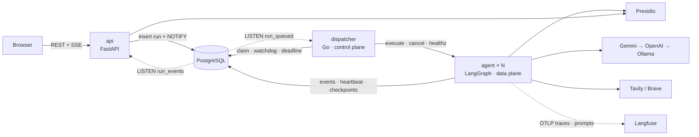
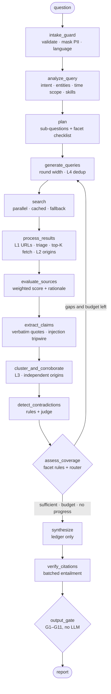

# AI Research Agent

From a complex research question to a sourced, citation-checked report.

Control flow lives in code, judgement lives in the model. The agent plans sub-questions, searches
in parallel, scores sources, extracts **claims with verbatim quotes**, clusters them into findings,
detects duplicates and contradictions, decides by rule whether it knows enough - and passes the
report through a **deterministic output gate** before anyone sees it.

Everything runs locally with Docker: a Python API and agent, a Go dispatcher, PostgreSQL,
Microsoft Presidio and self-hosted Langfuse. The only thing you bring is API keys.

> Design rationale: [`docs/design/architecture_v0.6.md`](docs/design/architecture_v0.6.md) (Turkish) ·
> decision log: [`TODO.md`](TODO.md) · audit: [`docs/design/analysis_v1.md`](docs/design/analysis_v1.md)

---

## 1. Quickstart

Requirements: Docker with Compose v2. The full stack uses about 4 GB of memory once running
(Langfuse, ClickHouse and Presidio are the heavy parts); lightweight mode about 1.5 GB.

```bash
cp .env.example .env         # optional: put your keys here - or enter them in the UI
docker compose up -d         # first start pulls images and builds (a few minutes)
open http://localhost:8000   # the app
```

**The one manual step: API keys.** You need one LLM key and one search key:

| Kind | Providers (either works; both give the agent a fallback) |
|---|---|
| LLM | [Google Gemini](https://aistudio.google.com/apikey) · [OpenAI](https://platform.openai.com/api-keys) |
| Search | [Tavily](https://app.tavily.com) · [Brave Search](https://api-dashboard.search.brave.com) |

Either paste them into **Settings** in the app (kept in the browser tab, encrypted per run on the
server, deleted when the run ends) or put them in `.env` as `GEMINI_API_KEY`, `OPENAI_API_KEY`,
`TAVILY_API_KEY`, `BRAVE_API_KEY` and run `docker compose up -d` again. Every other value has a
working local default - the database password, the encryption key (generated on first start),
and Langfuse's admin user and API keys (created headlessly).

| URL | What |
|---|---|
| http://localhost:8000 | The app: new research, live runs, reports, costs, prompts, settings |
| http://localhost:3000 | Langfuse - log in with `admin@research.local` / `research-admin` |
| http://localhost:8000/docs | OpenAPI docs of the REST API |
| http://localhost:8000/readyz | Which dependencies answer |

**Lightweight mode** - no Langfuse, ClickHouse, Redis or MinIO. The system stays fully functional:
traces come from Postgres, prompts from the repo YAML seeds.

```bash
COMPOSE_PROFILES= docker compose up -d      # or set COMPOSE_PROFILES= in .env
```

**Port already taken?** `API_HOST_PORT=8010 docker compose up -d` (likewise `LANGFUSE_HOST_PORT`,
`LANGFUSE_MINIO_HOST_PORT`, `POSTGRES_HOST_PORT`).

**No keys yet?** `make demo` records an offline run (a rule-based stand-in model over a three-page
built-in corpus) so every screen can be explored. It is marked "offline demo" in the UI and costs nothing.

<details>
<summary>More commands</summary>

```bash
docker compose up -d --scale agent=3             # more agent replicas; the dispatcher finds them by DNS
docker compose logs -f api agent dispatcher      # structured JSON logs, same field names in Python and Go
docker compose --profile local-llm up -d         # add Ollama as the last link of the LLM chain
make examples                                    # the four case examples, with your keys
make reset                                       # stop everything and delete all data

# The research CLI - same agent, no service layer; writes examples/<slug>/
docker compose run --rm agent run "Your question" --out examples/my-run
docker compose run --rm agent run "Your question" --simulate   # offline, no keys
docker compose run --rm agent config --override budget.max_searches=20
```
</details>

## 2. Technologies

| Layer | Choice |
|---|---|
| Orchestration | LangGraph `StateGraph` - nodes are plain async functions, routing and termination are plain Python; Postgres checkpointer |
| LLM | Gemini → OpenAI → Ollama fallback chain over REST (no vendor SDKs); `reasoning` and `fast` tiers; strict JSON-schema structured output |
| Search | Tavily (primary, returns page text) + Brave (fallback and diversity); `trafilatura` for pages that need fetching |
| Runtime | Python 3.13, uv, FastAPI, Pydantic v2, SQLAlchemy 2 + Alembic, psycopg 3, httpx, structlog, datasketch |
| Control plane | Go 1.27 dispatcher - queue claim, capacity, heartbeat watchdog, hard deadline, cancel, retry; distroless image |
| Storage | PostgreSQL 16 - run queue (`FOR UPDATE SKIP LOCKED` + `LISTEN/NOTIFY`), event store, checkpoints, caches, presets |
| PII | Microsoft Presidio analyzer with Turkish ad-hoc recognisers, always unioned with regex rules; stable placeholders assigned in code |
| Observability | Postgres `run_events` (primary) + self-hosted Langfuse v4 over OTLP (traces, prompt versions, cost) |
| Frontend | Static HTML + ES modules + Server-Sent Events, no build step |
| Quality | pytest (427 tests incl. Postgres integration and offline end-to-end graph runs), Go tests (70), ruff, mypy `--strict`, pre-commit with gitleaks |

## 3. Architecture

### 3.1 Services



The **dispatcher** only schedules: it claims queued runs with `SKIP LOCKED`, hands them to the
agent replica with the most free slots (`202 Accepted`, not a long request), requeues runs whose
heartbeat stops, and enforces a hard deadline no agent bug can outlive. It holds no run state and
refuses to start if given a provider key. The **agent** runs the graph, heartbeats every 10 s,
checkpoints every node, and writes the terminal status itself. Every status write on either side is
a compare-and-set checked against the shared state machine in [`contracts/`](contracts/).

A killed agent is recovered like this (verified): heartbeat stale after 30 s →
`AGENT_HEARTBEAT_LOST` → requeued with backoff → another replica resumes from the LangGraph
checkpoint, without re-running finished nodes, under the original deadline.

### 3.2 Agent workflow



Every LLM step returns a Pydantic object with a short `rationale`, which the run timeline shows -
the auditable reason for a decision, not hidden chain of thought. Every LLM step also has a
deterministic fallback (heuristic analysis, single-question plan, template queries, rule-based
scores, a report that lists the ledger), so a provider outage degrades the answer instead of
failing the run.

### 3.3 The central abstraction: the claim ledger

```
SearchHit → Document (score, origin) → Claim (+ verbatim quote) → ClaimCluster (finding) → sentence in the report
```

The system reasons about **claims**, not documents. One data model answers four requirements:

| Requirement | In the ledger |
|---|---|
| Duplicates | Near-identical pages share one `origin`; the same fact in different words is one cluster |
| Corroboration | A cluster's support is its number of **independent origins** - never its URL count |
| Contradictions | Two clusters with the same entity and attribute but different values |
| Citations | The synthesiser may only cite cluster ids; each id already knows its claims, quotes and sources |

## 4. Search strategy

- **Decomposition.** The planner writes 3-6 self-contained sub-questions, each with 1-5 checkable
  *facets* ("effective date", "penalty amount"). A sub-question is answered when all its facets are.
- **Round width is the budget control.** Round 1: up to 3 queries per open sub-question. Later
  rounds: one query per missing facet or unresolved contradiction, at most 8 per round. Four
  rounds therefore fit the 45-search budget.
- **Diversity.** Queries for the same target vary the angle (official vs. news), specificity and
  language (Turkish and English when both have sources). With both keys, every third query goes to
  Brave first. Skills add domain-specific query patterns (e.g. law numbers, `site:kvkk.gov.tr`).
- **No repeats.** Queries are deduplicated against everything already tried (L4). A follow-up round
  that can only produce repeats marks the sub-question exhausted.
- **Parallel, cached, bounded.** Searches run concurrently under a semaphore, retry with backoff,
  fall back to the other provider, and are cached in Postgres. An empty result gets one broadened
  retry. Cache hits still count against the budget so a cached re-run decides identically.
- **Snippet-first triage.** Only the top 5 documents per sub-question (3 in later rounds) are read in
  full; Tavily usually returns the page text with the result, otherwise the page is fetched with a
  byte cap and extracted with trafilatura.

## 5. Source evaluation

```
score = 0.35·authority + 0.25·primary + 0.15·recency + 0.25·relevance
```

- **Authority** comes from [`config/domain_tiers.yaml`](config/domain_tiers.yaml): T1 regulators and
  official sources, T2 established news and research firms, T3 everything else. Skills may add T1/T2
  domains for a run. The model may nudge authority by ±0.1 but can never move a domain across a
  tier - a page cannot talk its way into being a regulator.
- **Primary** if the publisher is the origin of the information: tier-1 sources, or the company's own
  domain for claims about itself; the model can recognise other primary sources outside tier 3.
- **Recency** relative to the question's time scope: in-scope and fresh scores high, older than the
  scope is penalised, undated is slightly below neutral.
- **Relevance** is judged by the model (with a token-overlap fallback).

Every score is written to the timeline with its components:
`[Evaluator] kvkk.gov.tr → 0.91 (T1, primary, 2026-03, relevance 0.85)`.

## 6. Duplicate detection

| Layer | Method | Catches |
|---|---|---|
| L1 URL | Canonicalisation: scheme, `www`/`m`/`amp` hosts, AMP suffixes, tracking parameters, sorted query, fragments | The same page twice |
| L2 Document | Normalised-text hash, then MinHash LSH (word 5-grams, Jaccard ≥ 0.8) → shared `origin_id` | Syndicated press releases, republished articles |
| L3 Claim | Embedding cosine (one embedding model per run, cached) **and** the same normalised entity; lexical fallback | One fact phrased differently |
| L4 Query | Normalised token Jaccard ≥ 0.9 | The same query generated again |

Two rules make the layers matter: **corroboration counts origins** (five sites carrying one press
release are one confirmation; a claim attributed to someone - "according to the ministry" - takes
that speaker as its origin), and **claims with different values are never merged**, however
similar the wording, because merging them would hide a contradiction.

## 7. Follow-up search and termination

After each round the code - not the model - updates every facet:

> a facet is **sufficient** if a primary source scoring ≥ 0.7 supports it, or ≥ 2 independent
> origins do - and no unresolved contradiction touches it.

The model's coverage review may add a missing facet and writes the gap note
(`[Research State] Missing information: partnerships.`), but it does not decide. Then the router
checks, in order:

1. **Success** - every `must` sub-question is sufficient → `sufficient`
2. **Hard limits** - `max_iterations` (4) or `max_searches` (45); optional wall-clock and cost
   budgets (off by default, enabled per run) → `budget` / `max_iterations`
3. **No progress** - a sub-question with no new finding or origin for 2 rounds is exhausted; when
   nothing is open → `no_progress`
4. Otherwise the next round searches **only the gaps**.

Whatever the reason, the report is written; exhausted and unanswered sub-questions are listed under
**Known Gaps**, and the stop reason appears in the report metadata and the UI. No evidence at all
gives a report that says so (`no_evidence`), never an invented answer.

## 8. Contradiction handling

1. **Candidates by rule:** same normalised entity and attribute, values that do not match within
   tolerance (numbers, money, percentages and dates are normalised - see §9).
2. **Classification by a judge:** true conflict, different point in time, different scope, or
   rounding. Only true conflicts mark findings as contested.
3. **Resolution:** the judge may prefer one side, but the preference only counts if the ledger backs
   it - a primary source that outranks the other side. The conflict is **still reported**.
   Unresolved conflicts get one targeted follow-up query looking for the primary source.
4. If it stays unresolved, the report's **Conflicting / Uncertain** section presents both values with
   their sources, and any sentence elsewhere that cites a contested finding is labelled uncertain.

## 9. The output gate

Nothing reaches the user without passing eleven deterministic rules ([`config/gate.yaml`](config/gate.yaml)).
No LLM call: the same report and ledger always give the same verdict - which also means a prompt
injection or a hallucinating model cannot argue with it.

| Rule | Checks | If violated |
|---|---|---|
| G1 | Required sections present; at least one supported finding | Section added / **fail** |
| G2 | Every factual sentence cites a finding | Sentence removed |
| G3 | Citations exist in the ledger; source list matches citations | Citation dropped, list rebuilt |
| G4 | Every number, date, percentage and amount is supported | By bucket, below |
| G5 | Contested findings are hedged | Labelled uncertain |
| G6 | Single-source findings are labelled | Labelled |
| G7 | Exhausted sub-questions are in Known Gaps | Added |
| G8 | Source URLs valid, canonical, unique | Fixed or dropped |
| G9 | No sensitive identifier or secret in the output | Masked |
| G10 | Report language = question language | Flagged |
| G11 | Every recommendation rests on a finding | Removed |

**G4 sorts every quantity into a bucket** before judging it, because "the number must appear in a
cited claim" alone would delete correct sentences:

- **context** - it appears in the question ("2026") → allowed;
- **ledger-derived** - a count of sources, findings or sub-questions → recomputed from the ledger;
- **bare fact** - must match a cited claim exactly (`1.2M` = `1,2 milyon`, `%15` = `15%`,
  currencies must agree) → otherwise the sentence is removed;
- **within tolerance** - rounding to the precision written (`$1.23 billion` as `$1.2 billion`),
  or a coarser date (`March 2026` for `2026-03-12`) → kept with an "approximate" label.

The gate evaluates, remediates deterministically, and evaluates again. If an error survives, the
report is still delivered - with a red "insufficient evidence" banner and the list of problems.
Whenever a sentence was removed, the report says how many. The full result is in
`gate_result.json` and in the run's **Gate** tab.

## 10. PII handling

Three boundaries (v0.6 §12):

- **Intake** - before the question is stored or sent anywhere, national ids (TCKN, checksum
  validated), IBANs, cards (Luhn), emails, phone numbers and IPs are replaced with stable
  placeholders (`<TCKN_1>` twice means one person). Presidio does the detection with Turkish ad-hoc
  recognisers; its findings are always unioned with regex rules, and if Presidio is down the regex
  rules run alone (`PII_ENGINE_DEGRADED`). Person and company names are **not** masked - they are
  what the research is about (configurable).
- **Telemetry** - every log line, run event, stored LLM/search payload and Langfuse span passes
  through redaction (provider keys, bearer tokens, connection strings and the identifiers above).
  Tests assert that keys never appear in responses, events or Langfuse payloads.
- **Output** - gate rule G9.

Provider keys follow their own path: browser tab → encrypted per run (Fernet) in `run_secrets` →
read by the agent → deleted with the run's terminal status. The dispatcher never sees them.

## 11. Observability

- **`run_events`** in Postgres is the primary trace, written by the agent and the dispatcher onto
  one gap-free timeline and streamed to the UI over SSE (resumable with `Last-Event-ID`). The
  console and UI keep the case's format: `[Planner] Created 4 research tasks.`,
  `[Search] Received 8 results.`, `[Research State] Missing information: partnerships.`
- **`llm_calls` / `search_calls`** record every attempt with tokens, cost, latency, prompt version
  and fallback source; they feed the **Costs** screen.
- **Langfuse** (self-hosted, headless init) receives each run as an OTLP trace with a generation per
  LLM call - usage, cost and the prompt name and version - and hosts prompt management. Prices live
  in [`config/models.yaml`](config/models.yaml), so both dashboards show the same numbers.
- **Logs** are JSON from both languages with shared fields (`service`, `run_id`, `span_id`, `node`,
  `event`, `error_code`).
- **Reproducibility** - each run stores its effective configuration and hash, the prompt versions
  and content hashes, the models used and the skills chosen.

## 12. Error handling

Every failure has a code from [`contracts/error_codes.yaml`](contracts/error_codes.yaml), shared by
Python and Go. Expected failures are handled, logged at warning level as
**error → decision → outcome**, and the run continues:

```
SEARCH_TIMEOUT (tavily, 2/3) → retry in 2s → fallback->brave → Received 7 results
```

Unexpected ones (`UNEXPECTED_EXCEPTION`) fail the run with a redacted stack trace and an event id.

| Situation | Code | Behaviour |
|---|---|---|
| Search timeout / 5xx / 429 | `SEARCH_TIMEOUT` · `SEARCH_PROVIDER_ERROR` · `SEARCH_RATE_LIMIT` | Retry with backoff → other provider → query marked failed, run continues |
| Rejected search key | `SEARCH_AUTH` | No retry → other provider |
| Empty result | `SEARCH_EMPTY` | Other provider; one broadened query |
| LLM timeout / 5xx / 429 | `LLM_TIMEOUT` · `LLM_PROVIDER_ERROR` · `LLM_RATE_LIMIT` | Retry → next provider (`LLM_FALLBACK_USED`) → node fallback |
| Rejected LLM key | `LLM_AUTH` | Next provider; none left → run fails with a message naming the missing key |
| Invalid structured output | `LLM_INVALID_OUTPUT` → `LLM_REPAIR_FAILED` | One repair turn with the validation error → node fallback |
| Quote not in the page | `EXTRACT_QUOTE_NOT_FOUND` | Claim discarded |
| Page fetch fails | `FETCH_FAILED` | Continue with the snippet |
| Embeddings unavailable | `EMBEDDING_UNAVAILABLE` | Lexical similarity for the rest of the run |
| Repeated queries | `DUPLICATE_QUERY` | Sub-question exhausted |
| Budget / rounds used | `BUDGET_EXCEEDED` · `MAX_ITERATIONS` | Controlled stop, Known Gaps |
| No evidence | `NO_EVIDENCE` | "No sufficient evidence" report |
| Presidio down | `PII_ENGINE_DEGRADED` | Regex masking only |
| Langfuse down / prompt incompatible | `PROMPT_REGISTRY_DEGRADED` · `PROMPT_SCHEMA_MISMATCH` | Repo YAML prompt |
| Gate | `GATE_REMEDIATED` · `GATE_FAILED` | Fixes / report with banner |
| Agent unreachable / crashed | `AGENT_UNREACHABLE` · `AGENT_HEARTBEAT_LOST` | Other replica / requeue and resume (≤ 3 attempts) |
| Hard deadline | `DEADLINE_EXCEEDED` | Agent asked to stop, then failed after a grace period |
| Invalid settings | `CONFIG_INVALID` | Rejected before the run exists |

## 13. Examples

See [`examples/`](examples/). The four case examples are generated with your keys by
`make examples`; `examples/offline-demo-eu-ai-act/` shows the file format from an offline run.

| # | Question | Why this one |
|---|---|---|
| 1 | Türkiye'deki SaaS şirketleri için 2026 KVKK uyum aksiyon planı nedir? | Turkish regulation, action plan tied to findings |
| 2 | ApilexAI'ın ürünleri, iş ortaklıkları ve stratejik yönü nedir? | Thin coverage → Known Gaps |
| 3 | What changed in the EU AI Act implementation timeline? | Conflicting dates → contradiction handling |
| 4 | What is the size of the European legal tech market and how fast is it growing? | Numeric disagreement → G4, conflicting section |

Each example contains `input.md`, `trace.jsonl`, `report.md`, `report.json`, `gate_result.json`
and `state.json`. Runs from the UI export the same files.

## 14. Tests

```bash
make test               # unit + contract tests, Python and Go, no database
make test-integration   # adds Postgres integration tests (starts a throwaway container)
make test-docker        # the Python suite inside the compose network
make lint               # ruff, mypy --strict, gofmt, go vet
```

| Layer | Covers |
|---|---|
| Unit | Contracts, config bounds and locked settings, redaction, masking (+Presidio), key handling, URL canonicalisation, MinHash, query dedup, scoring, quote verification, injection tripwire, clustering, contradiction candidates, facet sufficiency, router, number/date normalisation, every gate rule, providers (request shapes, error mapping, retry, fallback, repair), schemas on the wire, prompt registry and skills, Langfuse export |
| Scenario | The whole graph offline: success in one round, stagnation, max rounds, search budget, wall-clock and cost budgets switched on, search and LLM provider fallback, repair failure, no evidence, prompt injection, PII never reaching a provider, cancellation, **crash and resume from checkpoint**, Turkish reports, the CLI |
| API | Run creation with masking, encryption and override validation, SSE backfill / resume / live, cancel, export, costs, prompts, no key in any response |
| Integration | Migrations match the models; events are gap-free under concurrency; concurrent claims never double-claim; compare-and-set races; requeue budget; secrets deleted on finish; agent server behaviour against real Postgres |
| Go | Watchdog decision table, dispatch and fallback, capacity ranking and DNS discovery, agent client ↔ OpenAPI contract, state machine ↔ contract, store against Postgres (concurrent claims, CAS races, deadlines, backoff), NOTIFY listener |

## 15. Design decisions

- **Control flow in code, judgement in the model.** Loops, budgets, stop rules, dedup and scoring
  are deterministic and unit-tested; the model is asked narrow questions with typed answers.
  A free-form tool-calling agent gives weaker termination guarantees and is harder to test.
- **The claim ledger** as the unit of reasoning - one model for duplicates, corroboration,
  contradictions and citations.
- **A deterministic gate** as the last word, with remediation and a visible banner instead of silent
  failure.
- **Control plane / data plane split.** A small Go dispatcher owns scheduling, deadlines and
  recovery; agents can crash without losing runs, and a buggy agent cannot run forever. The price -
  a second language and an HTTP contract - is paid down with shared contract files and contract
  tests on both sides.
- **Prompts as versioned artefacts.** Signatures (typed I/O) in code, wording in Langfuse with repo
  YAML seeds, accepted only if the output-schema hash and template variables match the code.
- **One LLM access layer over REST** - fallback, retries, repair, redaction, cost and tracing are
  written once; no second LLM stack in the runtime.
- **Skills as data** (Agent Skills format): domain guidance and trusted domains, no scripts, no
  control over budgets or the gate.

The full log with alternatives considered is in [`TODO.md`](TODO.md).

### Known limitations

- Turkish person-name detection in Presidio is weak (English NER model); names are not masked by
  default for this reason and because they are the subject of research.
- Market-size and similar questions depend heavily on what search providers return; paywalled
  research is only visible through its public summaries.
- Claim extraction quality is bounded by the fast-tier model; the gate protects numbers and
  citations, not the completeness of what was extracted.
- No authentication - this is a local, single-user deployment.

---

## 16. Design Questions

> Bu bölümün cevapları Türkçedir (case gereği).

### 1. Agent araştırmayı ne zaman sonlandırıyor?

Karar LLM'de değil kodda. Her turdan sonra her alt sorunun facet'leri (cevaplanma kriterleri) kural
ile güncellenir: bir facet, skoru ≥ 0.7 olan birincil bir kaynakla **ya da** en az iki bağımsız
origin ile destekleniyorsa ve çözülmemiş bir çelişkiye dokunmuyorsa yeterlidir. Router sırayla
bakar: (1) tüm `must` alt sorular yeterliyse **başarı**; (2) tur ya da arama bütçesi bittiyse (ve
açıksa süre/maliyet bütçesi) **bütçe**; (3) açık alt soru kalmadıysa **ilerleme yok**; aksi halde
yalnızca eksik facet'ler ve çözülmemiş çelişkiler için yeni tur. Her durumda rapor yazılır;
cevaplanamayan alt sorular "Bilinen Eksikler"de listelenir ve durma nedeni raporda görünür.

### 2. Sistemin sonsuz search loop'una girmesini nasıl engelliyorsunuz?

Katmanlı: (1) sabit tur ve arama limitleri (4 tur, 45 arama) ve tur genişliği kuralı — ilk tur
geniş, sonraki turlar yalnızca eksiklere tek sorgu; (2) durgunluk — iki tur boyunca yeni bulgu ya
da yeni bağımsız kaynak getirmeyen alt soru "tükendi" sayılır; (3) sorgu tekrarı engeli — daha önce
denenmiş bir sorgunun yeniden yazılmış hali çalıştırılmaz, yalnızca tekrar üretilebiliyorsa alt soru
kapanır; (4) çelişki başına tek hedefli takip sorgusu; (5) LangGraph `recursion_limit`'i tur
sayısından türetilir; (6) en dışta, agent'tan bağımsız Go dispatcher'ın **hard deadline**'ı — agent'ta
bir hata olsa bile run süresiz koşamaz; önce durması istenir, süre dolunca başarısız sayılır.

### 3. Bir kaynağın güvenilirliğini nasıl değerlendiriyorsunuz?

Şeffaf, ağırlıklı bir skorla: `0.35·otorite + 0.25·birincillik + 0.15·güncellik + 0.25·ilgililik`.
Otorite içerikten değil, düzenlenebilir bir domain listesinden gelir (T1 resmi/regülatör, T2 yerleşik
haber ve araştırma kuruluşları, T3 diğerleri); model bunu tier içinde en fazla ±0.1 oynatabilir ama
bir blogu regülatör seviyesine çıkaramaz. Birincillik: bilginin kaynağı olan yayıncı (regülatör, resmi
gazete, şirketin kendi sitesi). Güncellik sorunun zaman kapsamına göre hesaplanır. İlgililik modelce
değerlendirilir. Bileşenler ve tek satırlık gerekçe her kaynak için zaman çizelgesine yazılır. Ayrıca
kaynak skoru tek başına bir iddiayı doğrulamaz: iddia, sayfada birebir geçen bir alıntıyla ve bağımsız
kaynak sayısıyla desteklenmelidir.

### 4. Aynı haberin farklı sitelerde yayınlanmasını nasıl duplicate olarak tespit ediyorsunuz?

Dört katmanla: URL normalizasyonu (aynı sayfa), normalize metin hash'i ve **MinHash** (kelime 5-gram,
Jaccard ≥ 0.8) ile aynı **origin**'e bağlama (sendikasyon, basın bülteni kopyaları), embedding +
aynı entity ile iddia kümeleme (aynı olgunun farklı ifadesi) ve sorgu tekrarı kontrolü. Belirleyici
kural: doğrulama **bağımsız origin** sayısıyla ölçülür, URL sayısıyla değil — aynı bülteni yayımlayan
beş site tek doğrulamadır. İddia "X'in açıklamasına göre" diyorsa X origin kabul edilir.

### 5. İki güvenilir kaynak birbiriyle çelişiyorsa sistem nasıl davranıyor?

Önce kural aynı varlık ve özellik için farklı değerleri aday olarak bulur (sayı, para, yüzde ve
tarihler normalize edilerek). Sonra bir yargıç model çelişkiyi sınıflandırır: gerçek çelişki, farklı
zaman noktası, farklı kapsam/tanım ya da yuvarlama. Gerçek çelişkide, daha yüksek skorlu birincil
kaynak tercih edilebilir — ama bu tercih ancak ledger destekliyorsa kabul edilir ve çelişki **yine
raporlanır**. Çözülemezse birincil kaynağı arayan tek bir hedefli sorgu atılır; hâlâ çözülmezse
rapordaki "Çelişkili / Belirsiz Bilgiler" bölümünde iki değer kaynaklarıyla birlikte verilir ve bu
bulgulara atıf yapan diğer cümleler "belirsiz" olarak işaretlenir.

### 6. LLM tarafından üretilmiş fakat hiçbir kaynak tarafından desteklenmeyen bir claim'in final cevaba girmesini nasıl engelliyorsunuz?

Derinlemesine savunma: (1) her iddianın sayfada **birebir** geçen bir alıntısı olmalı — rakamlar ve
yazıyla yazılmış sayılar dahil — yoksa iddia atılır; modele hitap eden cümleler ("önceki talimatları
yok say") kanıt sayılmaz; (2) sentez modeli web'i hiç görmez, yalnızca ID'li bulgu defterini görür ve
her olgusal cümle bulgu ID'si taşımak zorundadır; (3) ayrı bir doğrulama adımı her cümlenin atıf
yaptığı bulgularca desteklenip desteklenmediğini batch'ler halinde kontrol eder, bir kez geri
bildirimle yeniden yazdırır, desteklenmeyeni atar; (4) son sözü **deterministik Output Gate** söyler:
atıfsız cümle (G2), ledger'da olmayan atıf (G3) ve kaynakta karşılığı olmayan sayı/tarih/tutar (G4)
çıkarılır, çıkarılan cümle sayısı raporda yazılır, hiç desteklenen bulgu kalmazsa rapor "yetersiz
kanıt" uyarısıyla döner. Gate'te LLM olmadığı için prompt injection da onu ikna edemez.

### 7. Search sayısı, latency ve LLM token maliyeti arasında nasıl bir denge kuruyorsunuz?

Bütçenin asıl kontrolü tur genişliği: ilk tur geniş, sonraki turlar yalnızca eksiklere. Snippet-first
triage ile yalnızca alt soru başına ilk birkaç kaynak tam okunur; Tavily sayfa metnini aramayla
birlikte döndürdüğü için ayrıca fetch nadiren gerekir, ve `basic` derinlik arama başına 1 kredi harcar.
İki model katmanı var: planlama/sentez gibi yargı adımları `reasoning`, çıkarma/sınıflandırma gibi
yüksek hacimli adımlar ucuz `fast` modelde, düşük düşünme seviyesiyle. Arama, çıkarma ve doğrulama
paralel ve semaphore'la sınırlı; atıf doğrulama cümle başına değil batch'ler halinde. Arama ve
embedding sonuçları Postgres'te önbelleklenir. Token, maliyet ve süre sayaçları her zaman çalışır ve
UI'da canlı görünür; süre ve maliyet limitleri varsayılan kapalıdır ve run başına açılabilir.
Fiyatlar tek bir dosyada tutulur ve maliyet panosu model, node ve run bazında kırılım verir.

### 8. Bu sistemi production ortamına taşımanız gerekse hangi parçaları değiştirir veya geliştirirdiniz?

Platform: Kubernetes/Helm, yönetilen Postgres, anahtarlar için Fernet + `.env` yerine Vault/KMS,
SSO ve çok kiracılı yetkilendirme, API kimlik doğrulaması ve rate limit. Ölçek: agent ve dispatcher
için yatay otomatik ölçekleme; hacim artarsa Postgres kuyruğu yerine özel bir kuyruk; sağlayıcı başına
circuit breaker ve kota yönetimi; büyük fetch yükü için ayrı bir fetch servisi. Kalite: altın bir
değerlendirme seti ve prompt/model değişikliklerinde CI'da regresyon kapısı; offline prompt
optimizasyonu (DSPy/GEPA) Gate ihlallerini geri bildirim olarak kullanarak. Hukuk alanı: kurumca
yönetilen domain listeleri (Resmî Gazete, mevzuat, içtihat kaynakları), izin/yasak listeleri,
robots/kullanım koşulu uyumu. PII: Türkçe NER modeli, saklama ve silme politikası, denetim kaydı.
Gözlemlenebilirlik: OpenTelemetry collector (dispatcher span'leri dahil), Langfuse için harici
ClickHouse/S3 ve RBAC, maliyet ve hata alarmları. Ayrıca run'lar arası semantik önbellek (pgvector)
ve isteğe bağlı insan onaylı plan adımı.

---

## Project structure

```
├── docker-compose.yml        # the whole system; profiles: observability (default), local-llm, test
├── Makefile                  # shortcuts: up, test, lint, examples, demo, reset
├── config/                   # settings, models + prices, search, domain tiers, gate, pii, dispatcher, prompts/
├── contracts/                # shared by Python and Go: agent API (OpenAPI), run states, error codes
├── migrations/               # Alembic - the only owner of the schema
├── skills/                   # research skills (SKILL.md + references)
├── agent/src/research_agent/
│   ├── agent/                # graph, nodes, state (claim ledger), scoring, dedup, clustering, termination
│   ├── gate/                 # output gate: numeric normaliser, rules G1-G11, remediation
│   ├── prompting/            # signatures, prompt registry, skills, predictor
│   ├── providers/            # LLM (Gemini, OpenAI/Ollama), search (Tavily, Brave), fetch, embeddings
│   ├── pii/                  # intake masking (Presidio + regex)
│   ├── api/                  # FastAPI app, SSE, static UI
│   ├── agent_server/         # execute / cancel / healthz / capacity, heartbeat
│   ├── observability/        # structlog, redaction, run events, Langfuse
│   ├── db/                   # models, repository (queue semantics)
│   └── cli.py                # research config | contracts | run | serve | migrate
├── agent/tests/              # unit · scenario · api · contract · integration
├── dispatcher/               # Go control plane
├── examples/                 # example runs
└── docs/design/              # architecture and audit (Turkish)
```
